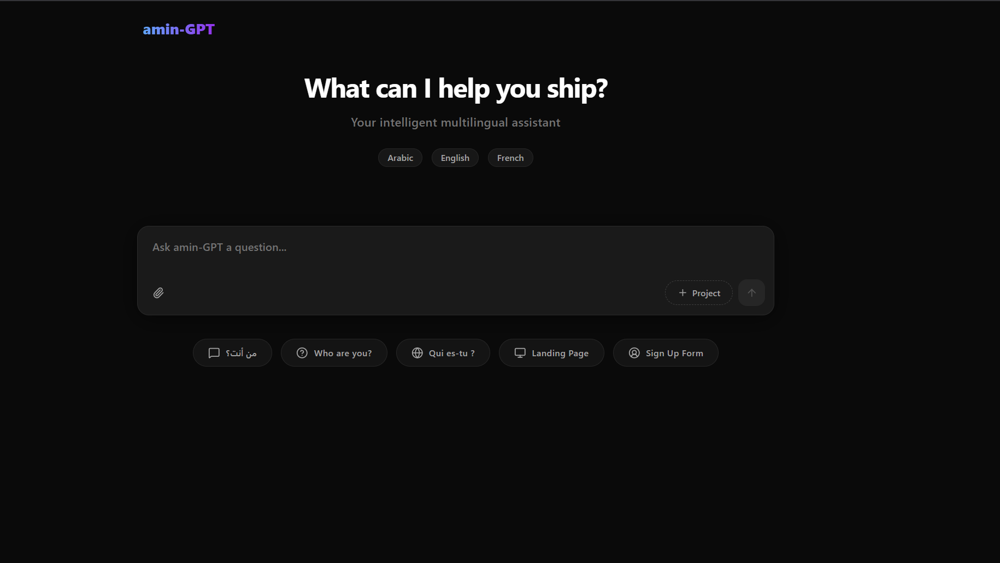

# amin-GPT


[](https://app.netlify.com/projects/amin-gpt/deploys)

> A multilingual AI chatbot powered by DeepSeek V4 via NVIDIA NIM. Built with a React frontend, Netlify Serverless proxy backend, Cloudflare Turnstile protection, and a human-like conversational personality. Supports Arabic, English, and French with automatic language detection.

---

## Screenshot



> *The main chat interface — dark theme, auto-resizing input, and real-time AI responses.*

---

## Table of Contents

- [Overview](#overview)
- [Tech Stack](#tech-stack)
- [Features](#features)
- [Architecture](#architecture)
- [Getting Started](#getting-started)
- [Project Structure](#project-structure)
- [Configuration](#configuration)
- [API Reference](#api-reference)
- [License](#license)

---

## Overview

**amin-GPT** is a full-stack conversational AI application that uses the powerful `deepseek-v4-pro` model, served through the NVIDIA NIM inference platform. The system is designed around a clean separation of concerns: a React single-page application handles the user interface and system prompts, while a lightweight Node.js Serverless Function on Netlify acts as a secure proxy between the browser and the NVIDIA API — keeping the API key server-side at all times. Additionally, it integrates Cloudflare Turnstile to prevent unauthorized bot access.

The chatbot is configured with a custom system prompt that gives it a distinct human-like personality, instructs it to use emojis naturally, and enforces automatic language switching based on the detected language of each user message.

---

## Tech Stack

| Layer | Technology | Purpose |
|---|---|---|
| Frontend | React 18 (Vite) | UI, state management, chat rendering |
| Styling | CSS3 / Tailwind CSS | Dark theme, responsive layout |
| Backend | Node.js (Netlify Functions) | Secure API proxy, strict CORS validation |
| Security | Cloudflare Turnstile | Anti-bot protection |
| AI Model | `deepseek-ai/deepseek-v4-pro` | Language model inference |
| Inference | NVIDIA NIM API | Hosted model endpoint |
| Communication | Server-Sent Events (SSE) | Real-time streaming response |
| Build Tool | Vite | Dev server and production build |

---

## Features

- **Real-Time Streaming** — utilizes Server-Sent Events (SSE) to stream responses chunk-by-chunk for an immediate, typing-like effect
- **Multilingual auto-detection** — responds in Arabic, English, or French based on the user's input, with no manual switching required
- **Human-like personality** — custom system prompt enforces warm, casual, emoji-enriched responses; the model never breaks character
- **Multi-turn conversation** — full conversation history is maintained client-side and sent with every request for contextual replies
- **Secure API key handling** — the NVIDIA API key never reaches the browser; all requests are proxied through Netlify
- **Cloudflare Turnstile** — validates client tokens before proxying requests to the upstream AI provider
- **Auto-resizing textarea** — the input field grows with the content and resets on send
- **Error handling** — API and network errors are caught, parsed, and displayed gracefully in the chat

---

## Architecture

```text
Browser (React SPA + Turnstile)
        |
        |  POST /.netlify/functions/chat
        |  { messages: [...], turnstile_token: "..." }
        v
   Netlify Function (chat.mjs)
        |
        |  1. Validates Turnstile Token via Cloudflare
        |  2. Injects NVIDIA API Key
        |  3. Forwards POST to NVIDIA
        |
        |  POST https://integrate.api.nvidia.com/v1/chat/completions
        v
   NVIDIA NIM API
        |
        |  deepseek-ai/deepseek-v4-pro
        v
   Netlify Function parses & streams response
        |
        |  data: { "choices": [...] }
        v
   React renders message bubble incrementally
```

The Netlify function is a secure stateless proxy. It receives the conversation history and turnstile token from the client, validates security, forwards the payload to NVIDIA, and streams the model's reply back to the client using Server-Sent Events.

---

## Getting Started

### Prerequisites

- Node.js 18+ and npm
- A Netlify account
- An NVIDIA NIM API key
- A Cloudflare Turnstile Site Key & Secret Key

### Installation

**1. Clone the repository**

```bash
git clone https://github.com/your-username/amin-gpt.git
cd amin-gpt
```

**2. Install frontend dependencies**

```bash
npm install
```

**3. Configure the environment variables**

Create a `.env` file in the root directory and add the following keys:

```ini
NVIDIA_API_KEY=your-nvidia-nim-api-key-here
TURNSTILE_SECRET_KEY=your-cloudflare-turnstile-secret-here
VITE_TURNSTILE_SITE_KEY=your-cloudflare-turnstile-site-key-here
```

**4. Start the React dev server & Netlify Functions**

```bash
npm run dev
```

**5. Open the app**

Navigate to `http://localhost:5173` in your browser.

---

## Project Structure

```text
amin-gpt/
|
├── netlify/
|   └── functions/
|       └── chat.mjs             # Netlify Serverless Proxy (API keys live here)
|
├── src/
|   ├── components/
|   |   └── ui/
|   |       └── v0-ai-chat.tsx   # Main chat application component
|   ├── lib/
|   |   └── utils.ts             # Utility functions
|   ├── App.tsx                  # Root component
|   ├── main.tsx                 # React entry point
|   └── index.css                # Global Tailwind CSS & themes
|
├── index.html                   # Vite HTML template
├── vite.config.ts               # Vite configuration + proxy setup
├── tailwind.config.js           # Tailwind config
├── netlify.toml                 # Netlify deployment configuration
├── package.json
└── README.md
```

---

## Configuration

### Model Parameters

The following parameters are configured inside `netlify/functions/chat.mjs` for the DeepSeek model:

| Parameter | Value | Notes |
|---|---|---|
| `model` | `deepseek-ai/deepseek-v4-pro` | The primary reasoning model |
| `max_tokens` | `16384` | Maximum reply length |
| `temperature` | `1.0` | Higher value = more natural, less repetitive |
| `top_p` | `0.95` | Nucleus sampling threshold |
| `stream` | `true` | Server-Sent Events (SSE) enabled |
| `thinking` | `false` | Passed via `chat_template_kwargs` to disable verbose thought chains |

---

## API Reference

### POST `/.netlify/functions/chat`

Accepts the current conversation history and Turnstile token, then streams the model's response.

**Request payload:**

```json
{
  "messages": [
    { "role": "system", "content": "You are amin-GPT..." },
    { "role": "user", "content": "Hello, who are you?" }
  ],
  "model": "deepseek-ai/deepseek-v4-pro",
  "turnstile_token": "0.xxxxxx"
}
```

**Response (Streaming SSE)**

```text
data: {"choices":[{"delta":{"content":"Hey!"}}]}
data: {"choices":[{"delta":{"content":" I'm amin-GPT,"}}]}
...
data: [DONE]
```

**HTTP Status Codes**

| Code | Meaning |
|---|---|
| `200` | Success |
| `400` | Invalid payload or messages |
| `403` | Unauthorized origin or Security verification failed |
| `405` | Non-POST request received |
| `500` | Server misconfiguration or upstream internal error |
| `502` | Security verification unavailable |

---

## License

This project is licensed under the MIT License. See the [LICENSE](./LICENSE) file for details.

---

<div align="center">
  Built by <strong>Amin</strong> — Université 8 Mai 1945, Guelma · Département d'Informatique
</div>
